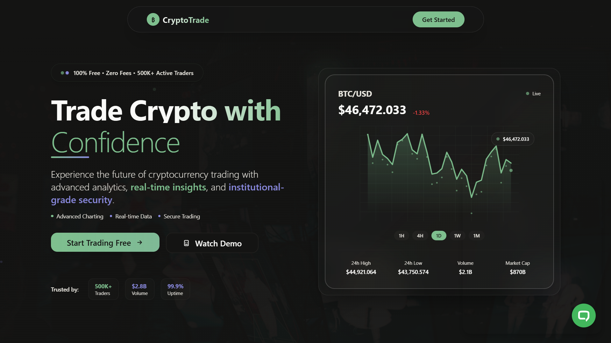
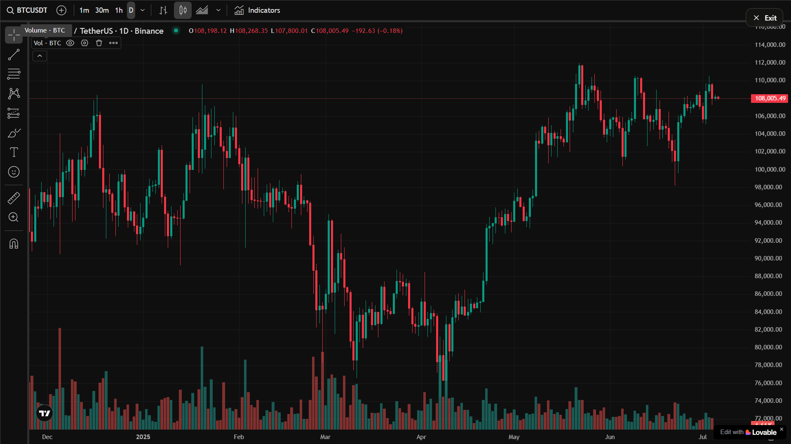
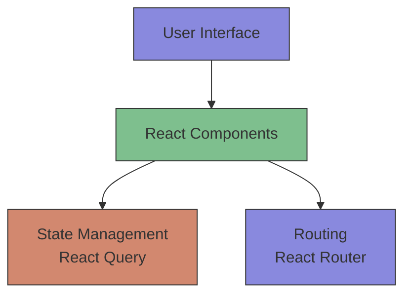
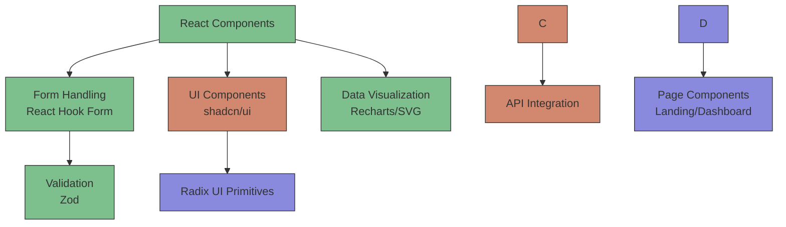
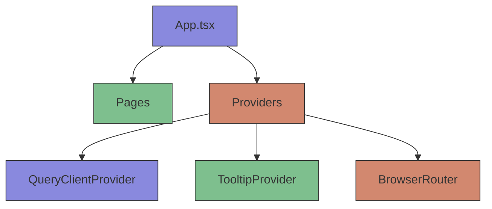
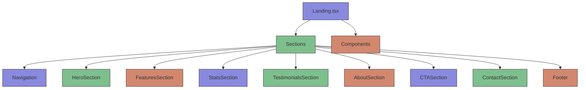
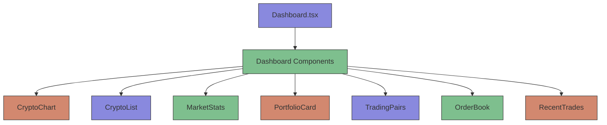
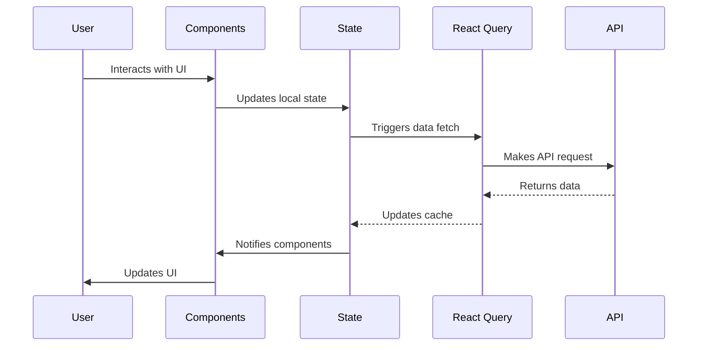

<h1 align="center">CryptoTrade</h1>

<p align="center">
  <b>Trade Crypto with Confidence</b><br>
  Advanced, zero-fee cryptocurrency trading platform with real-time analytics, institutional-grade security, and a modern UI.<br>
  
  
  
  
</p>

<p align="center">
  
</p>

---

## 🚀 Overview

**CryptoTrade** is a next-generation cryptocurrency trading platform designed for both beginners and professionals. Enjoy advanced charting, real-time data, portfolio management, and robust security—all with zero trading fees.

---

## ✨ Features

### Core Trading Features

| Feature                   | Description                                                                 |
|---------------------------|-----------------------------------------------------------------------------|
| **Advanced Trading Interface** | Professional-grade tools, real-time market data, and advanced charting.      |
| **Portfolio Management**  | Track investments and monitor gains with comprehensive tools.               |
| **Security & Verification** | Industry-leading security and KYC verification to protect your assets.      |
| **Performance Analytics** | Detailed analytics and insights for informed trading decisions.             |
| **Zero Fees**             | 100% free trading for all users.                                            |
| **Modern UI**             | Clean, responsive, and intuitive interface.                                 |

### Technical Features

1. **Real-time Data Streaming**
   - Live price updates for all supported cryptocurrencies
   - WebSocket integration for instant data delivery
   - Low-latency updates for active traders

2. **Advanced Charting**
   - Multiple chart types (candlestick, line, area)
   - Technical indicators (RSI, MACD, Bollinger Bands)
   - Drawing tools for technical analysis
   - Customizable timeframes

3. **Order Management**
   - Market and limit orders
   - Stop-loss and take-profit orders
   - Order history and tracking
   - Real-time order book updates

4. **Portfolio Tracking**
   - Asset allocation visualization
   - Performance metrics and analytics
   - Profit/loss calculations
   - Transaction history

5. **Market Analysis**
   - Cryptocurrency rankings
   - Market sentiment indicators
   - Trading volume analysis
   - Historical price data

### User Experience Features

1. **Responsive Design**
   - Works on desktop, tablet, and mobile devices
   - Touch-optimized interface for mobile trading
   - Adaptive layouts for different screen sizes

2. **Accessibility**
   - WCAG 2.1 AA compliance
   - Keyboard navigation support
   - Screen reader compatibility
   - High contrast mode

3. **Performance Optimization**
   - Fast loading times
   - Efficient data handling
   - Minimal resource usage
   - Offline capability for static content

4. **Security Features**
   - Two-factor authentication
   - Encrypted data transmission
   - Secure session management
   - Regular security audits

---

## 📊 Platform Statistics

| Metric           | Value    | Description                |
|------------------|----------|----------------------------|
| Trading Volume   | $2.8B+   | Monthly trading activity   |
| Active Traders   | 500K+    | Global community members   |
| Uptime           | 99.9%    | Platform reliability       |

---

## 🖼️ Preview

| Landing Page | Dashboard |
|--------------|-----------|
|  |  |

---

## 💡 Why Choose CryptoTrade?

- **100% Free**: No hidden fees, ever.
- **Real-Time Insights**: Stay ahead with live data and analytics.
- **Institutional-Grade Security**: Your assets are protected with the latest security standards.
- **Trusted by 500K+ Traders**: Join a growing global community.

---

## 🛠️ Tech Stack

### Frontend Framework

- **[React 18](https://reactjs.org/)**: Modern UI library for building interactive user interfaces
  - Concurrent features for improved performance
  - Automatic batching for state updates
  - New root API for better tree management

- **[TypeScript](https://www.typescriptlang.org/)**: Strongly typed programming language that builds on JavaScript
  - Type safety for reduced runtime errors
  - Improved developer experience with IntelliSense
  - Better code documentation and maintainability

### Build Tool

- **[Vite](https://vitejs.dev/)**: Next generation frontend tooling
  - Lightning fast cold server start
  - Instant hot module replacement (HMR)
  - Optimized builds with Rollup

### Styling

- **[TailwindCSS](https://tailwindcss.com/)**: Utility-first CSS framework
  - Custom theme configuration
  - Responsive design utilities
  - Dark mode support
  - Component-based styling approach

- **Custom Styling Features**:
  - Glass morphism effects
  - Gradient animations
  - Micro-interactions
  - Responsive typography

### UI Components

- **[shadcn/ui](https://ui.shadcn.com/)**: Re-usable components built with Radix UI and Tailwind CSS
  - Accessible UI components
  - Customizable with Tailwind CSS
  - Copy-paste component system
  - No runtime dependencies

- **[Radix UI](https://www.radix-ui.com/)**: Unstyled, accessible UI components
  - WCAG compliant components
  - Full keyboard navigation support
  - Screen reader tested
  - Focus management

### State Management

- **[React Query](https://tanstack.com/query/latest) (TanStack Query)**: Server state management
  - Caching and background updates
  - Request deduplication
  - Pagination and infinite queries
  - Mutations and optimistic updates

### Routing

- **[React Router](https://reactrouter.com/)**: Declarative routing for React
  - Dynamic routing
  - Nested routes
  - Programmatic navigation
  - Route-based code splitting

### Form Handling

- **[React Hook Form](https://react-hook-form.com/)**: Performant, flexible forms with easy validation
  - Minimal re-renders
  - Built-in validation with Zod
  - Easy integration with UI libraries
  - Accessibility support

### Data Visualization

- **[Recharts](https://recharts.org/)**: Charting library built with React components
  - Declarative charting components
  - Responsive charts
  - Rich interactivity
  - SVG-based rendering

- **Custom SVG Charts**: For lightweight, tailored visualizations
  - Animated line charts
  - Real-time data updates
  - Custom styling integration

### Validation

- **[Zod](https://zod.dev/)**: TypeScript-first schema declaration and validation library
  - Type inference
  - Error handling
  - Schema composition
  - Integration with React Hook Form

### Icons

- **[Lucide React](https://lucide.dev/)**: Beautiful & consistent icon toolkit
  - 1000+ icons
  - Consistent stroke width
  - Tree-shakable
  - React component exports

### Animation

- **[Framer Motion](https://www.framer.com/motion/)**: Production-ready motion library for React
  - Declarative API
  - Layout animations
  - Gesture support
  - Server-side rendering

### Development Tools

- **[ESLint](https://eslint.org/)**: JavaScript/TypeScript linting
  - Code quality rules
  - Formatting consistency
  - Error prevention

- **[Prettier](https://prettier.io/)**: Code formatter
  - Opinionated formatting
  - Editor integration
  - Pre-commit hooks

### Testing

- **[Jest](https://jestjs.io/)**: JavaScript testing framework
- **[React Testing Library](https://testing-library.com/)**: React component testing utilities
- **[Cypress](https://www.cypress.io/)**: End-to-end testing framework

### Deployment

- **[Vercel](https://vercel.com/)**: Cloud platform for static sites and Serverless Functions
  - Global CDN
  - Automatic HTTPS
  - Git integration
  - Serverless functions

---

## 🏗️ Architecture

### High-Level Architecture

The CryptoTrade platform follows a modern React architecture with clear separation of concerns:






### Component Architecture

#### Application Structure




#### Landing Page Components




#### Dashboard Components




### Data Flow Architecture



---

## 📁 Project Structure

The project follows a organized structure to maintain scalability and separation of concerns:

```
src/
├── components/              # Reusable UI components
│   ├── sections/            # Page sections (landing page components)
│   │   ├── AboutSection.tsx
│   │   ├── CTASection.tsx
│   │   ├── ContactSection.tsx
│   │   ├── FeaturesSection.tsx
│   │   ├── Footer.tsx
│   │   ├── HeroSection.tsx
│   │   ├── Navigation.tsx
│   │   ├── StatsSection.tsx
│   │   └── TestimonialsSection.tsx
│   ├── ui/                  # shadcn/ui components
│   │   ├── button.tsx
│   │   ├── card.tsx
│   │   ├── dialog.tsx
│   │   └── ...              # Other UI components
│   ├── BackgroundGrid.tsx
│   ├── ChatWidget.tsx
│   ├── CryptoChart.tsx
│   ├── CryptoList.tsx
│   ├── MarketStats.tsx
│   ├── OrderBook.tsx
│   ├── PortfolioCard.tsx
│   ├── RecentTrades.tsx
│   ├── TradingChart.tsx
│   └── TradingPairs.tsx
├── hooks/                   # Custom React hooks
│   ├── use-toast.ts
│   ├── useContentLoader.ts
│   └── useScrollPosition.ts
├── lib/                     # Utility functions
│   └── utils.ts
├── pages/                   # Page components
│   ├── Dashboard.tsx
│   ├── Index.tsx
│   └── Landing.tsx
├── App.css
├── App.tsx                  # Main application component
├── index.css
├── main.tsx                 # Entry point
└── vite-env.d.ts
```

### Key Components

#### 1. **Landing Page** (`/src/pages/Landing.tsx`)
The main entry point for new users with marketing-focused sections:

- **HeroSection**: Main value proposition with animated trading chart
- **FeaturesSection**: Key platform features with icons
- **StatsSection**: Platform statistics and achievements
- **TestimonialsSection**: User testimonials and reviews
- **AboutSection**: Company information and mission
- **CTASection**: Call-to-action for signups
- **ContactSection**: Contact information and form
- **Footer**: Additional links and legal information

#### 2. **Dashboard** (`/src/pages/Dashboard.tsx`)
The main trading interface for authenticated users:

- **CryptoChart**: Advanced TradingView integration for real-time charting
- **MarketStats**: Real-time market statistics and indicators
- **PortfolioCard**: User portfolio overview and performance
- **TradingPairs**: Available cryptocurrency trading pairs
- **OrderBook**: Current buy/sell orders for selected pair
- **RecentTrades**: History of recent trades
- **CryptoList**: List of available cryptocurrencies with prices

#### 3. **Core Components**

- `CryptoChart.tsx`: Advanced TradingView chart with fullscreen capability
- `TradingChart.tsx`: Custom SVG-based chart for landing page animations
- `MarketStats.tsx`: Real-time market statistics display
- `PortfolioCard.tsx`: User portfolio management component
- `TradingPairs.tsx`: List of available trading pairs with prices
- `OrderBook.tsx`: Order book display with buy/sell levels
- `RecentTrades.tsx`: Recent trades history with timestamps
- `BackgroundGrid.tsx`: Animated background grid for visual appeal
- `ChatWidget.tsx`: Customer support chat interface

---

## 🎨 Design System

### Color Palette

The platform uses a carefully crafted color palette designed for optimal readability and visual appeal in a trading environment:

| Color     | Value     | Usage                        |
|-----------|-----------|------------------------------|
| Primary   | `#8989DE` | Main brand color             |
| Success   | `#7EBF8E` | Positive actions & data      |
| Warning   | `#D2886F` | Warnings & secondary actions |
| Secondary | `#3A3935` | Backgrounds & cards          |
| Foreground| `#FAFAF8` | Text & primary content       |
| Background| `#141413` | Main background              |

### Typography

- **Primary Font**: System UI stack (tailwind default)
- **Font Weights**: 
  - Light: 300
  - Regular: 400
  - Medium: 500
  - Bold: 700

The typography system emphasizes readability with appropriate sizing and spacing for financial data.

### Animations

The platform incorporates subtle animations to enhance user experience without being distracting:

- **Fade In**: `animate-fade-in` - Used for content reveals
- **Slide Up**: `animate-slide-up-fade` - Used for modal entries
- **Pulse**: `animate-pulse-subtle` - Used for live data indicators
- **Float**: `animate-float` - Used for decorative elements
- **Scale In**: `animate-scale-in` - Used for fullscreen transitions

### UI Components

The platform utilizes shadcn/ui components built on Radix UI primitives for accessible and customizable UI elements:

- **Buttons**: Primary, secondary, and outline variants
- **Cards**: Glass-morphism effect cards with backdrop blur
- **Dialogs**: Modal windows for confirmations and forms
- **Tables**: Data tables with sorting capabilities
- **Charts**: Recharts for data visualization and custom SVG charts

### Responsive Design

The platform follows a mobile-first responsive approach with breakpoints at:

- **Small**: 640px (sm)
- **Medium**: 768px (md)
- **Large**: 1024px (lg)
- **Extra Large**: 1280px (xl)
- **2X Large**: 1536px (2xl)

All components are designed to work seamlessly across device sizes with appropriate touch targets for mobile users.

---

## 📦 Getting Started

### Prerequisites

- Node.js (v16 or higher)
- npm or yarn
- Git

### Installation

```bash
# Clone the repository
git clone <repository-url>
cd Crypto-Trade

# Install dependencies
npm install

# Start the development server
npm run dev
```

The development server will start at `http://localhost:8080` by default.

### Available Scripts

```bash
# Start development server
npm run dev

# Build for production
npm run build

# Preview production build
npm run preview

# Lint code
npm run lint

# Build development version
npm run build:dev
```

---

## 🔧 Development

### Project Structure Guidelines

1. **Component Organization**
   - Reusable components go in `src/components/`
   - Page-specific components go in `src/pages/`
   - UI primitives go in `src/components/ui/`
   - Section components go in `src/components/sections/`

2. **Naming Conventions**
   - Components: PascalCase (`UserProfile.tsx`)
   - Functions: camelCase (`getUserData()`)
   - Constants: UPPER_SNAKE_CASE (`API_BASE_URL`)
   - Files: PascalCase for components, camelCase for utilities

3. **Styling**
   - Use TailwindCSS utility classes
   - Leverage custom color palette
   - Implement responsive design with mobile-first approach
   - Use glass morphism effects with `glass-card` class
   - Apply animations with predefined classes

### State Management

The application uses multiple state management approaches:

1. **Local Component State**
   - Managed with React's `useState` hook
   - Suitable for component-scoped data

2. **Global State**
   - Managed with React Query for server state
   - Form state with React Hook Form

3. **Custom Hooks**
   - Reusable logic encapsulated in custom hooks
   - Located in `src/hooks/` directory

### Component Development

To create a new component:

1. Create a new file in the appropriate directory
2. Use TypeScript for type safety
3. Follow existing styling patterns
4. Export the component properly
5. Add to index file if needed

Example component structure:
``tsx
import { useState } from 'react';

interface ComponentProps {
  title: string;
  initialValue?: number;
}

const CustomComponent = ({ title, initialValue = 0 }: ComponentProps) => {
  const [value, setValue] = useState(initialValue);
  
  return (
    <div className="glass-card p-4 rounded-lg">
      <h2 className="text-xl font-semibold mb-2">{title}</h2>
      <p>Value: {value}</p>
      <button 
        onClick={() => setValue(v => v + 1)}
        className="btn-enhance mt-2"
      >
        Increment
      </button>
    </div>
  );
};

export default CustomComponent;
```

### Styling Guidelines

1. **TailwindCSS Usage**
   - Prefer utility classes over custom CSS
   - Use consistent spacing (multiples of 4px)
   - Leverage the custom color palette

2. **Responsive Design**
   - Mobile-first approach
   - Use appropriate breakpoints
   - Test on multiple screen sizes

3. **Animations**
   - Use predefined animation classes
   - Keep animations subtle and purposeful
   - Ensure accessibility compliance

4. **Glass Morphism Effects**
   - Use the `glass-card` class for frosted glass effects
   - Combine with `backdrop-blur` for enhanced effects
   - Maintain appropriate contrast for readability

### API Integration

1. **Data Fetching**
   - Use React Query for server state management
   - Implement proper error handling
   - Add loading states for better UX

2. **Form Handling**
   - Use React Hook Form for form state
   - Implement Zod for validation
   - Provide user feedback for form actions

### Testing

Currently, the project does not include automated tests. Consider adding:

- Unit tests with Jest and React Testing Library
- Integration tests for critical user flows
- End-to-end tests with Cypress

### Performance Optimization

1. **Code Splitting**
   - Use dynamic imports for large components
   - Lazy load non-critical resources

2. **Bundle Optimization**
   - Analyze bundle size with `npm run build -- --analyze`
   - Remove unused dependencies

3. **Image Optimization**
   - Use modern image formats (WebP)
   - Implement lazy loading for images

---

## 🚀 Deployment

### Building for Production

```bash
npm run build
```

This creates an optimized production build in the `dist/` directory.

### Environment Variables

Create a `.env` file in the root directory:

```env
VITE_API_URL=your_api_url
VITE_APP_NAME=CryptoTrade
```

### Deployment Options

1. **Vercel** (Recommended)
   - Connect your GitHub repository
   - Automatic deployments on push
   - Custom domain support

2. **Netlify**
   - Drag and drop the `dist/` folder
   - Or connect Git repository
   - Automatic SSL

3. **Traditional Hosting**
   - Upload the contents of `dist/` to your web server
   - Configure your server to serve `index.html` for all routes

### CI/CD Pipeline

The project includes a basic CI/CD setup with GitHub Actions:

1. **Build Process**
   - Install dependencies
   - Run linting checks
   - Build production assets

2. **Deployment Process**
   - Deploy to staging on pull requests
   - Deploy to production on main branch pushes

### Performance Monitoring

Consider implementing:

- Error tracking with Sentry
- Performance monitoring with Lighthouse
- Analytics with Google Analytics or Plausible

---

## 🧪 Testing

The project currently lacks automated tests but follows these testing principles:

### Testing Strategy

1. **Unit Testing**
   - Test individual components in isolation
   - Mock external dependencies
   - Focus on business logic

2. **Integration Testing**
   - Test component interactions
   - Verify API integrations
   - Test user flows

3. **End-to-End Testing**
   - Test complete user journeys
   - Verify cross-browser compatibility
   - Test responsive behavior

### Recommended Testing Tools

1. **Jest** - JavaScript testing framework
2. **React Testing Library** - React component testing
3. **Cypress** - End-to-end testing
4. **Storybook** - Component development and testing

### Test Coverage

Aim for the following coverage targets:

- Unit tests: 70%+ of components
- Integration tests: 50%+ of critical flows
- End-to-end tests: 30%+ of user journeys

---

## 🤝 Contributing

1. Fork the repository
2. Create a feature branch
3. Commit your changes
4. Push to the branch
5. Open a pull request

### Code Review Process

All submissions require review. We use GitHub pull requests for this process.

### Coding Standards

1. Follow the existing code style
2. Write clear commit messages
3. Include tests for new features
4. Update documentation as needed

---

## 🙌 Testimonials

> "CryptoTrade has completely transformed my trading experience. The platform is intuitive, fast, and completely free."  
> <sub>— Sarah Chen, Professional Trader</sub>

> "The advanced charting tools and real-time analytics are exceptional. Plus, zero fees means more money stays in my pocket."  
> <sub>— Michael Rodriguez, Crypto Enthusiast</sub>

---

## 📞 Contact

- **Email:** mausamkumkar@gmail.com
- **Phone:** +91 86238545574

---

## ⚖️ License

This project is licensed under the MIT License.

---

<p align="center">
  <sub>© 2024 CryptoTrade. All rights reserved. Trade responsibly.</sub>
</p>