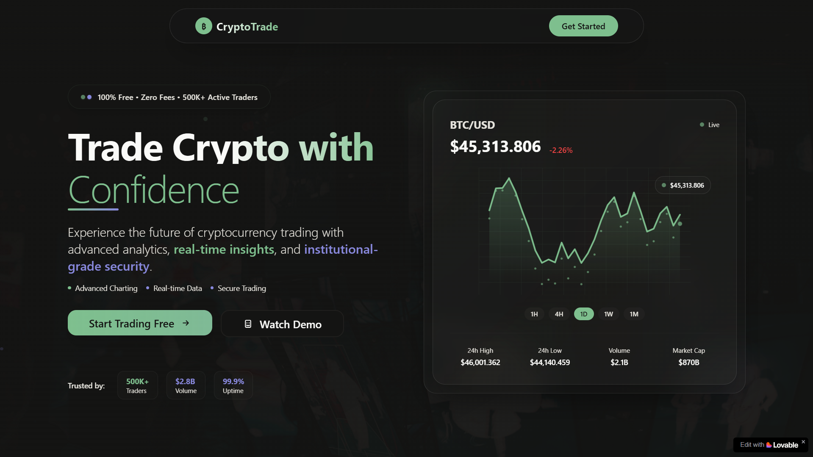

<p align="center">
  
</p>

<h1 align="center">CryptoTrade</h1>

<p align="center">
  <b>Trade Crypto with Confidence</b><br>
  Advanced, zero-fee cryptocurrency trading platform with real-time analytics, institutional-grade security, and a modern UI.<br>
  
  
  
  
</p>

<p align="center">
  
</p>

---

## 🚀 Overview

**CryptoTrade** is a next-generation cryptocurrency trading platform designed for both beginners and professionals. Enjoy advanced charting, real-time data, portfolio management, and robust security—all with zero trading fees.

---

## ✨ Features

| Feature                   | Description                                                                 |
|---------------------------|-----------------------------------------------------------------------------|
| **Advanced Trading Interface** | Professional-grade tools, real-time market data, and advanced charting.      |
| **Portfolio Management**  | Track investments and monitor gains with comprehensive tools.               |
| **Security & Verification** | Industry-leading security and KYC verification to protect your assets.      |
| **Performance Analytics** | Detailed analytics and insights for informed trading decisions.             |
| **Zero Fees**             | 100% free trading for all users.                                            |
| **Modern UI**             | Clean, responsive, and intuitive interface.                                 |

---

## 📊 Platform Statistics

| Metric           | Value    | Description                |
|------------------|----------|----------------------------|
| Trading Volume   | $2.8B+   | Monthly trading activity   |
| Active Traders   | 500K+    | Global community members   |
| Uptime           | 99.9%    | Platform reliability       |

---

## 🖼️ Preview

| Landing Page | Dashboard |
|--------------|-----------|
|  |  |

---

## 💡 Why Choose CryptoTrade?

- **100% Free**: No hidden fees, ever.
- **Real-Time Insights**: Stay ahead with live data and analytics.
- **Institutional-Grade Security**: Your assets are protected with the latest security standards.
- **Trusted by 500K+ Traders**: Join a growing global community.

---

## 🛠️ Tech Stack

- **React 18** + Vite
- **TypeScript**
- **TailwindCSS** (custom theme)
- **Radix UI** components
- **Recharts** for data visualization

---

## 📦 Getting Started

```bash
# Install dependencies
npm install --legacy-peer-deps

# Start the development server
npm run dev
```

---

## 🙌 Testimonials

> "CryptoTrade has completely transformed my trading experience. The platform is intuitive, fast, and completely free."  
> <sub>— Sarah Chen, Professional Trader</sub>

> "The advanced charting tools and real-time analytics are exceptional. Plus, zero fees means more money stays in my pocket."  
> <sub>— Michael Rodriguez, Crypto Enthusiast</sub>

---

## 📞 Contact

- **Email:** support@cryptotrade.com
- **Phone:** +1 (555) 123-4567

---

## ⚖️ License

This project is licensed under the MIT License.

---

<p align="center">
  <sub>© 2024 CryptoTrade. All rights reserved. Trade responsibly.</sub>
</p>